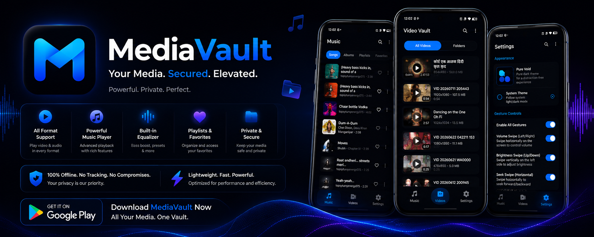

🎵 MediaVault

MediaVault

✨ Beautiful • Fast • Modern • Private

A premium offline media player crafted with Kotlin, Jetpack Compose, Material 3 and AndroidX Media3.

⚡ **Lightning Fast** • 🎵 **Rich Audio** • 🎬 **Smooth Video** • 🎨 **Material You** • 🔒 **Privacy First**

---

⭐ Star the repository if you enjoy MediaVault!

---

📖 Table of Contents

- ✨ Overview
- 🌟 Highlights
- 🎵 Features
- 📱 Screenshots
- 🏗 Architecture
- 🛠 Tech Stack
- ⚡ Performance
- 🔒 Privacy
- 📦 Installation
- 🚀 Build
- 🔄 Update System
- 🗺 Roadmap
- 🤝 Contributing
- 📜 License

---

✨ Overview

MediaVault is a next-generation offline media player built exclusively for Android.

Every screen, animation, transition, and interaction has been designed with one goal:

«Deliver a beautiful media experience that feels smooth, modern, elegant, and truly native.»

Unlike traditional media players, MediaVault embraces Material Design 3, modern Android architecture, and high-performance rendering to provide a polished experience across phones and tablets.

---

🌟 Why MediaVault?

✅ Beautiful Material 3 Interface

✅ Smooth 120Hz Animations

✅ Powerful Music Player

✅ Gesture Video Player

✅ AMOLED Black Theme

✅ Modern Mini Player

✅ Professional Equalizer

✅ Playlist Management

✅ Favorites

✅ Dynamic Colors

✅ Background Playback

✅ Media3 Powered

---

🎵 Features

🎧 Audio Player

Experience music the way it should be.

✔ Beautiful Now Playing Screen

✔ Animated Album Artwork

✔ Queue Management

✔ Shuffle

✔ Repeat

✔ Sleep Timer

✔ Playback Speed

✔ Lock Screen Controls

✔ Bluetooth Controls

✔ Headphone Controls

✔ Background Playback

✔ Notification Controls

✔ Resume Playback

---

🎬 Video Player

Designed for immersive viewing.

✔ Double Tap Seek

✔ Brightness Gestures

✔ Volume Gestures

✔ Swipe to Seek

✔ Subtitle Support

✔ Playback Speed

✔ Fullscreen

✔ Picture in Picture

✔ Hardware Acceleration

✔ Orientation Support

---

🎚 Equalizer

Professional audio customization.

✔ 10 Band Equalizer

✔ Bass Boost

✔ Loudness Enhancement

✔ Virtualizer

✔ Presets

✔ Custom Profiles

✔ One Tap Reset

---

❤️ Library Management

Organize your media beautifully.

✔ Songs

✔ Albums

✔ Artists

✔ Playlists

✔ Favorites

✔ Recently Played

✔ Most Played

✔ Search

---

📃 Playlist Features

✔ Create Playlist

✔ Rename Playlist

✔ Delete Playlist

✔ Add Songs

✔ Remove Songs

✔ Reorder Songs

✔ Persistent Storage

---

🎨 User Experience

Every pixel has been refined.

✔ Material You

✔ Material 3

✔ Dynamic Colors

✔ AMOLED Black Theme

✔ Light Theme

✔ Edge-to-Edge

✔ Responsive Layouts

✔ Tablet Support

✔ Landscape Support

✔ Fluid Motion

✔ Beautiful Typography

---

📱 Screenshots

Home| Player| Video
assets/home.png| assets/player.png| assets/video.png

Playlist| Equalizer| Settings
assets/playlist.png| assets/equalizer.png| assets/settings.png

---

🏗 Modern Architecture

                   UI Layer
          Jetpack Compose + Material 3
                    │
                    ▼
              ViewModels (MVVM)
                    │
                    ▼
              Domain Layer
        Use Cases • Business Logic
                    │
                    ▼
               Repository
                    │
      ┌─────────────┼─────────────┐
      ▼             ▼             ▼
  MediaStore      Room        DataStore
                    │
                    ▼
      AndroidX Media3 / ExoPlayer

---

🛠 Tech Stack

Layer| Technology
Language| Kotlin
UI| Jetpack Compose
Design| Material 3
Architecture| MVVM
Pattern| Clean Architecture
Dependency Injection| Hilt
Media Engine| AndroidX Media3
Database| Room
Preferences| DataStore
Image Loading| Coil
Async| Coroutines
Streams| Flow
Navigation| Navigation Compose
Build| Gradle Kotlin DSL

---

⚡ Performance

MediaVault has been engineered for speed.

- ⚡ Fast Startup
- ⚡ Low Memory Usage
- ⚡ Smooth Scrolling
- ⚡ Efficient Album Art Loading
- ⚡ Lazy Rendering
- ⚡ Hardware Accelerated Video
- ⚡ Optimized Database Queries
- ⚡ Battery Friendly
- ⚡ Stable Playback

---

🎼 Supported Formats

Audio

- MP3
- AAC
- M4A
- WAV
- FLAC
- OGG
- OPUS

Video

- MP4
- MKV
- WEBM
- MOV
- AVI
- 3GP

---

🔒 Privacy

MediaVault respects your privacy.

✅ No Analytics

✅ No Tracking

✅ No Ads

✅ No Account Required

✅ No Media Upload

✅ 100% Offline Playback

---

📦 Installation

git clone https://github.com/Playboy-gg/MediaVault.git

cd MediaVault

---

🚀 Build

Debug APK

./gradlew assembleDebug

Release APK

./gradlew assembleRelease

---

🔄 Built-in GitHub Update System

MediaVault automatically checks for updates using the GitHub Releases API.

Features include:

- Automatic Version Detection
- Material 3 Update Dialog
- Release Notes
- Ignore Version
- Direct Download
- Semantic Version Comparison

---

🗺 Roadmap

- Android Auto
- Wear OS
- Chromecast
- Lyrics Support
- Folder Browser
- Gapless Playback
- Crossfade
- Backup & Restore
- Smart Playlists
- Desktop Version

---

❤️ Why You'll Love It

MediaVault combines elegant design, modern Android technologies, fluid animations, and powerful playback capabilities into one seamless experience.

Whether you're listening to your favorite music or watching high-quality videos, every interaction is crafted to feel smooth, beautiful, and intuitive.

---

🤝 Contributing

Contributions are always welcome!

Whether it's fixing bugs, improving the UI, optimizing performance, or adding new features, every contribution helps make MediaVault even better.

---

📜 License

Copyright © 2026 Playboy-gg

All Rights Reserved.

---

⭐ Star this repository if MediaVault impressed you.

Built with ❤️ using Kotlin, Jetpack Compose, Material 3 & AndroidX Media3.

Beautiful UI • Powerful Playback • Modern Android

